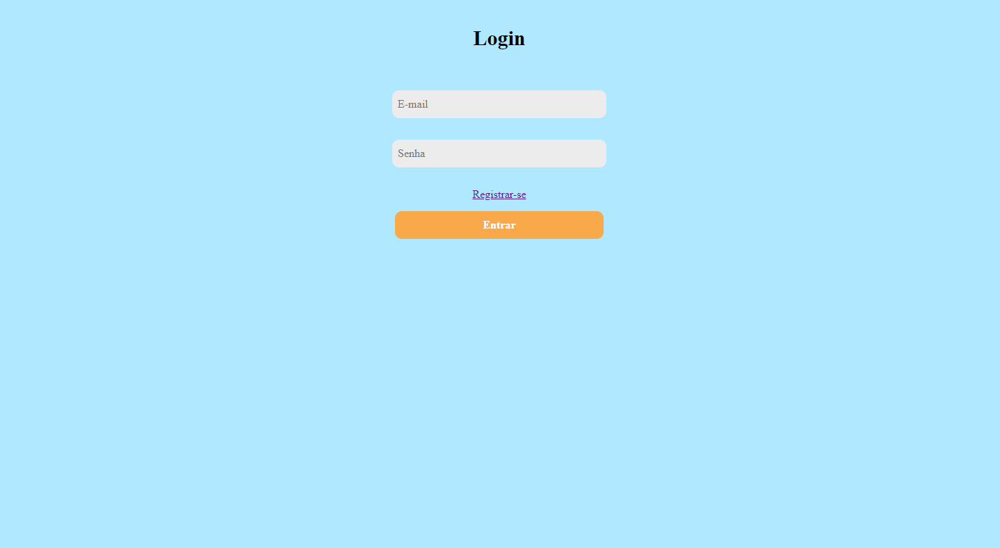

<h1 align="center"> Cadastro de Produtos </h1>

Site de cadastro de produtos, com página de login, registro, cadastro de produtos e edição de perfil e produtos.  

  <a href="#-tecnologias">Tecnologias</a>&nbsp;&nbsp;&nbsp;|&nbsp;&nbsp;&nbsp;
  <a href="#-projeto">Projeto</a>&nbsp;&nbsp;&nbsp;
  

 

  

## 🚀 Tecnologias

Esse projeto foi desenvolvido com as seguintes tecnologias:

- HTML e CSS
- PHP
- MySQL

## 💻 Projeto

Projeto realizado no curso de Assis.de Aplicativos Computacionais para a aula de PHP.

Proposta: 
- Criar um banco de Dados usuario e produtos
- Conectar o Banco de Dados com o código PHP

Especificações anotadas no arquivo .txt